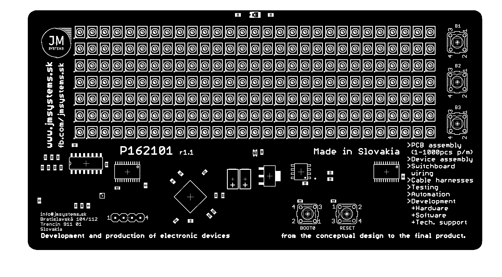
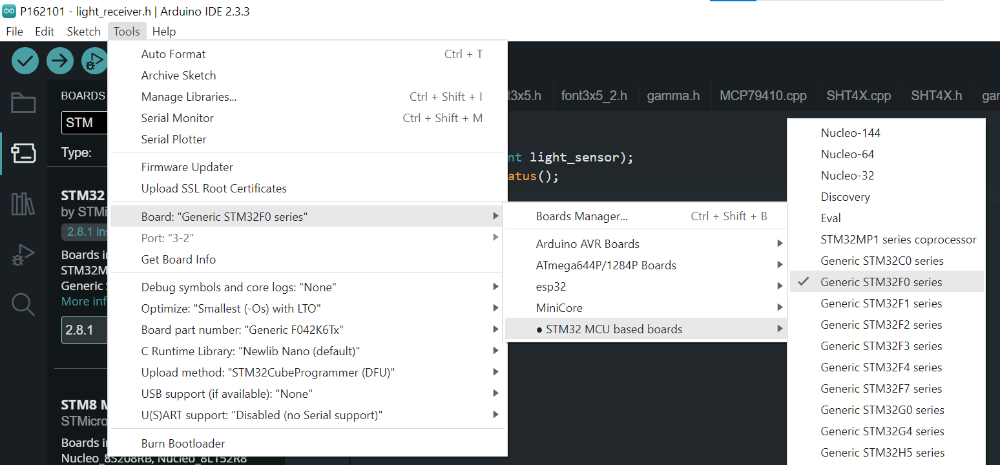

# Clock P162101
The P162101 development board is an open source tool, that opens up a world of endless possibilities in the field of the electronic device development. It was designed by the [JM Systems, s.r.o.](https://jmsystems.sk) as an ideal platform for everyone – from the beginners to the professionals and educational institutions. The P162101 board offers cutting-edge technology in the form of unique LED screen, that can display useful informations, whether you use it for fun or for practical applications.

The **P162101** board is a stand-alone mounted PCB designed for easy placement on a table or shelf. The dominant feature of the board is the **29x7 dot-matrix LED display** which can display information such as:
 - **Exact time** with seconds
 - **Date** and day of the week
 - Current **temperature** and **humidity**
 - Other interesting functions, e.g. the **name calendar** or an interactive **minigame**!

There is an on-board mounted **phototransistor**, which provides seamless light change detection, and the brightness of the display automatically adjust to the ambient light conditions.

You can find the [wiring diagram](docs/schematic_r1.1.pdf) of the board and [source codes](P162101.ino) of the sample software in this repository. The software is written in the Arduino development environment with an extension to support STM32 microcontrollers - **STM32duino**.

## Technical specification
 - MCU: [STM32F042K6T6](https://www.st.com/en/microcontrollers-microprocessors/stm32f042k6.html)
   - ARM 32-bit Cortex-M0
   - max. 48MHz
   - 32 KB flash memory
   - 6 KB SRAM memory
   - USB 2.0 Full Speed Controller
   - USB DFU Bootloader
 - LED display
   - 29x7 dots
   - Multiplexed wiring
     - 2x 74HC154 (columns)
     - 1x 74HC595 (rows)
 - 4 separate buttons, RESET button
 - Light sensor
 - [MCP79410](https://www.microchip.com/en-us/product/mcp79410) - Combined RTC IC with EEPROM memory
 - [SHT40](https://sensirion.com/products/catalog/SHT40) - Temperature and humidity sensor
 - Possibility of extension by [SCD40](https://sensirion.com/products/catalog/SCD40) CO2 sensor for even more environmental data
 - Power supply from USB (type B)

## Demonstration program
Every **P162101** board comes with the pre-flashed sample software, which contains 7 main screens and a special testing mode to verify the functionality during production. Demo software also includes advanced features such as RTC calibration and temperature compensation to ensure maximum clock accuracy.

1. Clock with seconds
2. Day of the week
3. Date
4. Name calendar
5. Current temperature
6. Current humidity
7. Minigame

__Press__ the **BOOT0** button to change the screen.

__Hold__ down the **BOOT0** button to turn on/off the automatic screen changes.

*NOTE: The clock crystal temperature compensation only works if the device is powered by USB.*

### Clock and date setting
The date and clock are set by using the B1, B2, B3 buttons (on the right side of the board) when  the the corresponding screen is shown.

|Button  |Clock screen   |Date screen |
|--------|---------------|------------|
|B1      | hours  + 1    | day + 1    |
|B2      | minutes + 1   | month + 1  |
|B3      | seconds reset | year + 1   |

### Minigame
You are a rocket pilot and your goal is to shoot as many falling asteroids as possible. The more asteroids you shoot, the more difficult the game becomes. The game ends when an asteroid hits your rocket.

To start the minigame press any button B1/B2/B3 on the "GAME" screen. Controls:

|Button  |Action                  |
|--------|------------------------|
|B1      | move right / up        |
|B2      | fire                   |
|B3      | move left / down       |
|BOOT0   | exit game              |

## How to build demo program
1. Install [Arduino](https://www.arduino.cc/en/software) development environment.
2. Install extension STM32duino according to the [official manual](https://github.com/stm32duino/Arduino_Core_STM32/wiki/Getting-Started#add-stm32-boards-support-to-arduino).
3. Install the [STM32CubeProgrammer](https://www.st.com/en/development-tools/stm32cubeprog.html) tool, which will allow you to use the USB DFU bootloader (includes USB drivers for Windows).
4. Select the STM32F0 generic board in the editor:  Adjust the other settings according to the picture:
    - `Debug symbols and core logs: "None"`
    - `Optimize: "Smallest (-Os) with LTO"`
    - `Board part number: "Generic F042K6Tx"`
    - `C Runtime Library: "Newlib Nano (default)"`
    - `Upload method: "STM32CubeProgrammer (DFU)"`
    - `USB Support (if available): "None"`
    - `U(S)ART Support: "Disabled (no Serial support)"`
5. Click on the Verify button to compile the project.
6. Connect the P162101 board to PC and activate DFU bootloader:
	1. Press and hold the BOOT0 button.
    2. Press and release the RESET button (while holding the BOOT0 button).
    3. The devices connects as "STM32 BOOTLOADER". In case of a missing driver, refer to the step 3.
7. Click the Upload button to upload the program to the board.

## Participate and contribute to the project community
This project is open to anyone, who wants to contribute, expand possibilities, or adapt it for their own purposes. All documentation and source code is freely available, allowing you to make the most of your creativity and innovative ideas. Join the community of developers, who are constantly improving the **P162101** board.

You can start contributing at any time by [creating a fork](https://github.com/jendo42/P162101/fork).
