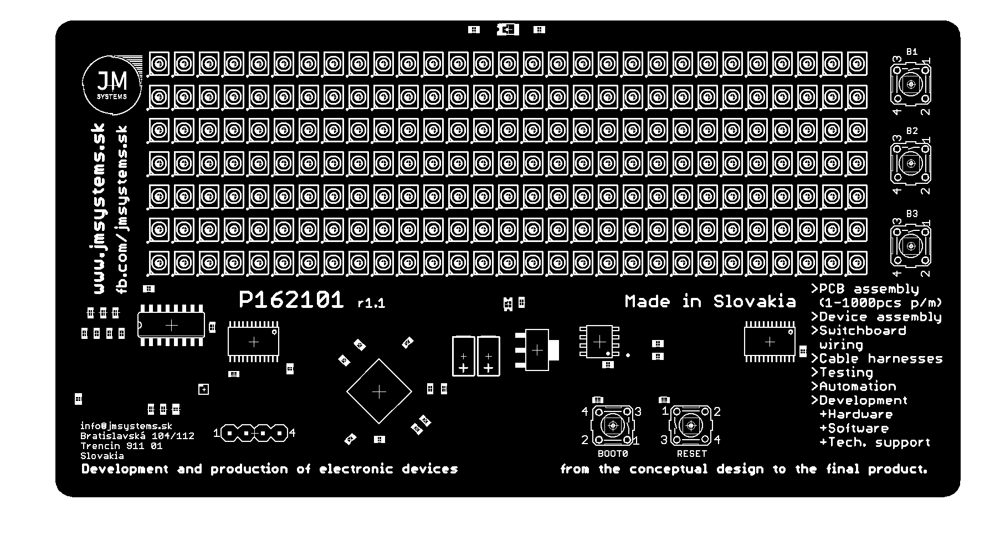
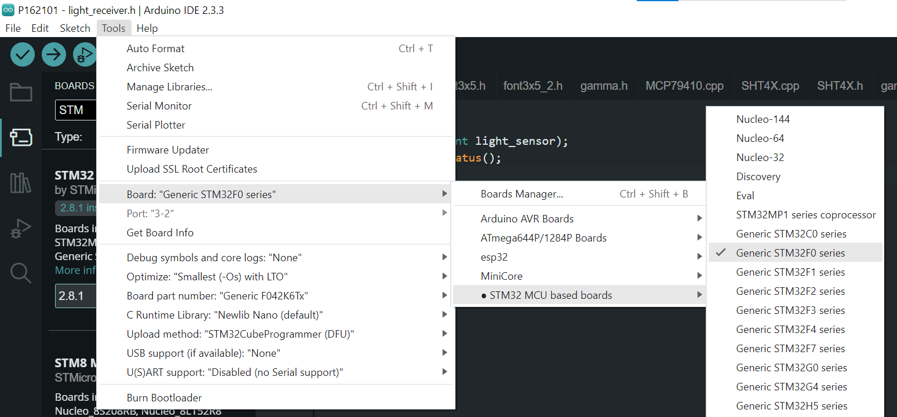

# Hodiny P162101
Vývojová doska P162101 je otvorený nástroj, ktorý vám otvára svet nekonečných možností v oblasti vývoja elektronických zariadení. Navrhnutá spoločnosťou [JM Systems, s.r.o.](https://jmsystems.sk), táto doska je ideálnou platformou pre všetkých – od začiatočníkov až po profesionálov a vzdelávacie inštitúcie. S doskou P162101 získate nielen špičkové technológie, ale aj zábavu a praktické využitie vo forme unikátnej LED obrazovky, ktorá dokáže zobraziť užitočné dáta.

Doska **P162101** je samostatný osadený plošný spoj navrhnutý pre jednoduché umiestnenie na stôl alebo poličku. Dominanta dosky je **29x7 bodový LED displej** na ktorom možno zobraziť informácie ako:
 - **Presný čas** so sekundami
 - **Dátum** a deň v týždni
 - Aktuálnu **teplotu** a **vlhkosť vzduchu**
 - Iné zaujímavé funkcie, ako napríklad **menný kalendár** alebo interaktívnu **minihru**!

Na doske je osadený fototranzistor, ktorý zabezpečuje plynulú detekciu zmeny osvetlenia a jas displeja sa automaticky prispôsobí okolitým svetelným podmienkam.

[Schéma zapojenia dosky](docs/schematic_r1.1.pdf) a [zdrojové kódy](P162101.ino) ukážkového softvéru nájdete práve v tomto repozitári. Softvér je napísaný vo vývojovom prostredí Arduino s rozšírením pre podporu mikrokontrolérov STM32.

## Technické parametre
 - MCU: [STM32F042K6T6](https://www.st.com/en/microcontrollers-microprocessors/stm32f042k6.html)
   - ARM 32-bit Cortex-M0
   - max. 48MHz
   - 32 KB flash pamäť
   - 6 KB SRAM pamäť
   - USB 2.0 Full Speed Controller
   - USB DFU Bootloader
 - LED displej
   - rozmer 29x7 bodov
   - multiplexné zapojenie
     - 2x 74HC154 (stĺpce)
     - 1x 74HC595 (riadky)
 - 4 nezávislé tlačidlá, tlačidlo RESET
 - Senzor osvetlenia
 - Kombinovaný RTC čip s EEPROM pamäťou [MCP79410](https://www.microchip.com/en-us/product/mcp79410)
 - Senzor teploty a vlhkosti [SHT40](https://sensirion.com/products/catalog/SHT40)
 - Možnosť doosadiť senzor CO2 [SCD40](https://sensirion.com/products/catalog/SCD40)
 - Napájanie cez USB

## Ukážkový program
Každá doska **P162101** prichádza s predinštalovaným vzorovým programom, ktorý obsahuje 7 hlavných obrazoviek a špeciálny testovací režim, ideálny na overenie funkčnosti počas výroby. Tento softvér zahŕňa aj pokročilé funkcie, ako je kalibrácia RTC a teplotná kompenzácia, čím zabezpečíte maximálnu presnosť hodín.

*POZNÁMKA: Teplotná kompenzácia hodinového kryštálu funguje len v prípade že zariadnie je napájané z USB.*

1. Hodiny so sekundami
2. Deň v týždni
3. Dátum
4. Meniny
5. Aktuálna teplota
6. Aktuálna vlhkosť vzduchu
7. Minihra

__Stlačením__ tlačidla **BOOT0** zmeníte obrazovku.
__Podržaním__ tlačidla **BOOT0** vypnete/zapnete automatické zmeny obrazovky.

### Nastavenie hodín a dátumu
Dátum a hodiny sa nastavujú tak, že na obrazovke hodín alebo dátumu použijete tlačidlá B1, B2, B3 na strane.

|Tlačidlo|Obrazovka hodín|Obrazovka dátumu|
|--------|--------------|------------|
|B1      | hodiny + 1   | deň + 1    |
|B2      | minúty + 1   | mesiac + 1 |
|B3      | reset sekúnd | rok + 1    |

### Minihra
Ste pilot v rakete a Vaším cielom je zostreliť čo najviac padajúcich asteroidov. Čím viac asteroidov zničíte, tým sa zvyšuje obtiažnosť hry. V prípade že asteroid narazí do rakety hra končí.

Pre spustenie minihry na obrazovke "GAME" stlačte ľubovolné tlačidlo B1/B2/B3. Ovládanie:

|Tlačidlo|Akcia                   |
|--------|------------------------|
|B1      | pohyb doprava / hore   |
|B2      | streľba                |
|B3      | pohyb doľava / dore    |
|BOOT0   | ukončenie hry          |

## Zostavenie ukážkového programu
1. Nainštaluje si vývojové prostredie [Arduino](https://www.arduino.cc/en/software)
2. Nainštalujte si rozšírenie STM32duino podľa [oficiálneho návodu](https://github.com/stm32duino/Arduino_Core_STM32/wiki/Getting-Started#add-stm32-boards-support-to-arduino)
3. Nainštalujte si nástroj [STM32CubeProgrammer](https://www.st.com/en/development-tools/stm32cubeprog.html) ktorý umožní používať USB DFU booloader (obsahuje ovládače pre Windows).
3. V editore si zvoľte generickú dosku STM32F0  Podľa obrázka nastavte aj ostatné nastavenia:
    - `Debug symbols and core logs: "None"`
    - `Optimize: "Smallest (-Os) with LTO"`
    - `Board part number: "Generic F042K6Tx"`
    - `C Runtime Library: "Newlib Nano (default)"`
    - `Upload method: "STM32CubeProgrammer (DFU)"`
    - `USB Support (if available): "None"`
    - `U(S)ART Support: "Disabled (no Serial support)"`
4. Kliknutím na tlačidlo *Verify* skompilujete projekt.
5. Pripojte dosku P162101 do PC a aktivujte DFU bootloader.
    1. Stlačte a držte dlačidlo BOOT0
    2. Stlačte a uvoľnite tlačidlo RESET (počas držania tlačidla BOOT0)
    3. Zariadenie sa pripojí do PC ako "STM32 BOOTLOADER". V prípade že vám chýba ovládač zariadenia, pozrite krok 3.
6. Kliknutím na tlačidlo *Upload* nahráte program na dosku.

## Podieľajte sa na projekte a prispievajte do komunity
Tento projekt je otvorený každému, kto chce prispievať, rozširovať jeho možnosti alebo ho prispôsobovať na vlastné účely. Všetky podklady a zdrojové kódy sú voľne dostupné, čo vám umožňuje naplno využiť svoju kreativitu a inovatívne nápady. Pridajte sa ku komunite vývojárov, ktorí neustále vylepšujú dosku **P162101**.

Prispievať môžete začat kedykoľvek [vytvorením forku](https://github.com/jendo42/P162101/fork).
