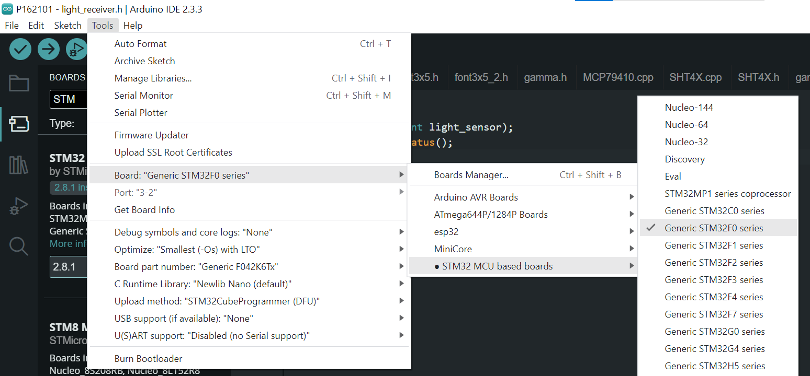

# Hodiny P162101
Vývojová doska P162101 je opensource nástroj, ktorý otvára svet nekonečných možností v oblasti vývoja elektronických zariadení. Spoločnost [JM Systems, s.r.o.](https://jmsystems.sk) navrhla túto dosku ako praktickú a vzdelávaciu platformu pre všetkých – od začiatočníkov až po profesionálov a vzdelávacie inštitúcie. S doskou P162101 získate nielen špičkové technológie, ale aj zábavu a praktické využitie vo forme unikátnej LED obrazovky, ktorá dokáže zobraziť užitočné informácie.

Doska **P162101** je samostatný osadený plošný spoj navrhnutý pre jednoduché umiestnenie na stôl alebo poličku. Dominanta dosky je **29x7 bodový LED displej** na ktorom možno zobraziť informácie ako:
 - **Presný čas** so sekundami
 - **Dátum** a deň v týždni
 - Aktuálnu **teplotu** a **vlhkosť vzduchu**
 - Iné zaujímavé funkcie, ako napríklad **menný kalendár** alebo interaktívnu **minihru**!

Na doske je osadený **fototranzistor**, ktorý zabezpečuje plynulú detekciu zmeny osvetlenia a jas displeja sa automaticky prispôsobí okolitým svetelným podmienkam.

[Schému zapojenia dosky](docs/schematic_r1.1.pdf) a [zdrojové kódy](P162101.ino) ukážkového softvéru nájdete práve v tomto repozitári. Softvér je napísaný vo vývojovom prostredí Arduino s rozšírením pre podporu mikrokontrolérov STM32 - **STM32duino**.

## Technické parametre
 - MCU: [STM32F042K6T6](https://www.st.com/en/microcontrollers-microprocessors/stm32f042k6.html)
   - ARM 32-bit Cortex-M0
   - max. 48MHz
   - 32 KB flash pamäť
   - 6 KB SRAM pamäť
   - USB 2.0 Full Speed Controller
   - USB DFU Bootloader
 - LED displej
   - rozmer 29x7 bodov
   - multiplexné zapojenie
     - 2x 74HC154 (stĺpce)
     - 1x 74HC595 (riadky)
 - 4 nezávislé tlačidlá, tlačidlo RESET
 - Senzor osvetlenia
 - [MCP79410](https://www.microchip.com/en-us/product/mcp79410) - Kombinovaný RTC čip s EEPROM pamäťou
 - [SHT40](https://sensirion.com/products/catalog/SHT40) - Senzor teploty a vlhkosti
 - Možnosť pridať senzor CO2 [SCD40](https://sensirion.com/products/catalog/SCD40) pre ešte viac environmentálnych údajov
 - Napájanie z USB (typ B)

## Ukážkový program
Každá doska **P162101** obsahuje predinštalovaný vzorový program, ktorý pozostáva zo 7 hlavných obrazoviek a špeciálny testovací režim na overenie funkčnosti počas výroby. Tento softvér zahŕňa aj pokročilé funkcie, ako je kalibrácia RTC a teplotná kompenzácia, čím zabezpečíte maximálnu presnosť hodín.

1. Hodiny so sekundami
2. Deň v týždni
3. Dátum
4. Meniny
5. Aktuálna teplota
6. Aktuálna vlhkosť vzduchu
7. Minihra

__Stlačením__ tlačidla **BOOT0** zmeníte obrazovku.

__Podržaním__ tlačidla **BOOT0** vypnete/zapnete automatické zmeny obrazovky.

*POZNÁMKA: Teplotná kompenzácia hodinového kryštálu funguje len v prípade že zariadnie je napájané z USB.*

### Nastavenie hodín a dátumu
Dátum a hodiny sa nastavujú tak, že na obrazovke hodín alebo dátumu použijete tlačidlá B1, B2, B3 ktoré sa nachádzajú na pravej strane dosky.

|Tlačidlo|Obrazovka hodín|Obrazovka dátumu|
|--------|--------------|------------|
|B1      | hodiny + 1   | deň + 1    |
|B2      | minúty + 1   | mesiac + 1 |
|B3      | reset sekúnd | rok + 1    |

### Minihra
Ste pilot v rakete a vaším cieľom je zostreliť čo najviac padajúcich asteroidov. Čím viac asteroidov zničíte, tým sa zvyšuje náročnosť hry. Hra končí, keď raketa narazí do asteroidu.

Pre spustenie minihry na obrazovke „GAME“ stlačte ľubovoľné tlačidlo B1/B2/B3. Ovládanie:

|Tlačidlo|Akcia                   |
|--------|------------------------|
|B1      | pohyb doprava / hore   |
|B2      | streľba                |
|B3      | pohyb doľava / dole    |
|BOOT0   | ukončenie hry          |

## Zostavenie ukážkového programu
1. Nainštalujte si vývojové prostredie [Arduino](https://www.arduino.cc/en/software).
2. Nainštalujte si rozšírenie STM32duino podľa [oficiálneho návodu](https://github.com/stm32duino/Arduino_Core_STM32/wiki/Getting-Started#add-stm32-boards-support-to-arduino).
3. Nainštalujte si nástroj [STM32CubeProgrammer](https://www.st.com/en/development-tools/stm32cubeprog.html) ktorý umožní používať USB DFU bootloader (obsahuje USB ovládače pre Windows)
4. V editore si zvoľte generickú dosku STM32F0:  Podľa obrázka nastavte aj ostatné nastavenia:
    - `Debug symbols and core logs: "None"`
    - `Optimize: "Smallest (-Os) with LTO"`
    - `Board part number: "Generic F042K6Tx"`
    - `C Runtime Library: "Newlib Nano (default)"`
    - `Upload method: "STM32CubeProgrammer (DFU)"`
    - `USB Support (if available): "None"`
    - `U(S)ART Support: "Disabled (no Serial support)"`
5. Kliknutím na tlačidlo *Verify* skompilujete projekt.
6. Pripojte dosku P162101 do PC a aktivujte DFU bootloader.
    1. Stlačte a držte tlačidlo BOOT0.
    2. Stlačte a uvoľnite tlačidlo RESET (počas držania tlačidla BOOT0).
    3. Zariadenie sa pripojí do PC ako „STM32 BOOTLOADER“. V prípade že vám chýba ovládač zariadenia, pozrite krok 3.
7. Kliknutím na tlačidlo *Upload* nahráte program na dosku.

## Podieľajte sa na projekte a prispievajte do komunity
Tento projekt je otvorený každému, kto chce prispievať, rozširovať jeho možnosti alebo ho prispôsobovať na vlastné účely. Všetky podklady a zdrojové kódy sú voľne dostupné, čo vám umožňuje naplno využiť svoju kreativitu a inovatívne nápady. Pridajte sa ku komunite vývojárov, ktorí neustále vylepšujú dosku **P162101**.

Prispievať môžete začat kedykoľvek [vytvorením forku](https://github.com/jendo42/P162101/fork).
