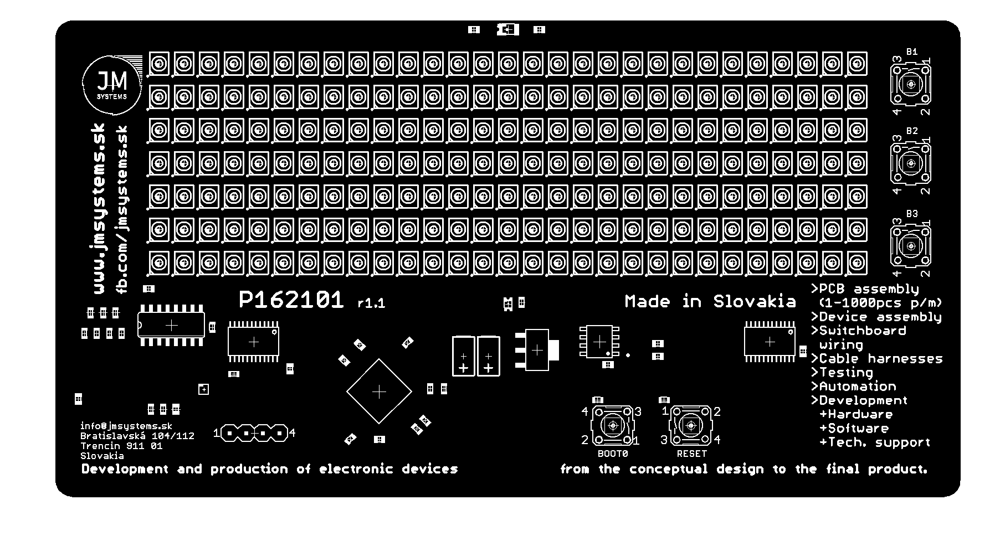

# Hodiny P162101
Vývojová doska P162101 je otvorený vývojový projekt navrhnutý firmou [JM Systems, s.r.o.](https://jmsystems.sk), ktorý má demonštrovať možnosti a podporiť vzdelávanie v oblasti vývoja a výroby elektronických zariadení.

Doska P162101 je samostatný osadený plošný spoj navrhnutý tak, aby sa dal postaviť na stôl alebo poličku. Dominanta dosky je 29x7 bodový LED display na ktorom možno zobraziť rôzne praktické údaje ako čas, teplotu, vlhkosť a iné.

[Schéma zapojenia dosky](docs/schematic_r1.1.pdf) a [zdrojové kódy](P162101.ino) ukážkového softvéru nájdete práve v tomto repozitári. Softvér je napísaný vo vývojovom prostredí Arduino s rozšírením pre podporu mikrokontrolérov STM32.

## Technické parametre
 - MCU: [STM32F042K6T6](https://www.st.com/en/microcontrollers-microprocessors/stm32f042k6.html)
   - ARM 32-bit Cortex-M0
   - max. 48MHz
   - 32 KB flash pamäť
   - 6 KB SRAM pamäť
   - USB 2.0 Full Speed Controller
   - USB DFU Bootloader
 - LED displej
   - rozmer 29x7 bodov
   - multiplexné zapojenie
     - 2x 74HC154 (stĺpce)
	 - 1x 74HC595 (riadky)
 - 4 nezávislé tlačidlá, tlačidlo RESET
 - Senzor osvetlenia
 - Kombinovaný RTC čip s EEPROM pamäťou [MCP79410](https://www.microchip.com/en-us/product/mcp79410)
 - Senzor teploty a vlhkosti [SHT40](https://sensirion.com/products/catalog/SHT40)
 - Možnosť doosadiť senzor CO2 [SCD40](https://sensirion.com/products/catalog/SCD40)
 - Napájanie cez USB

## Ukážkový program
Každé zariadenie vychádza z výroby s nahratým ukážkovým programom. Ukážkový program obsahuje 7 hlavných obrazoviek a skrytý testovací mód, ktorý sa používa na oživenie výrobku počas výroby. Tento program tiež obsahuje kalibráciu RTC a teplotnú kompenzáciu.

*POZNÁMKA: Teplotná kompenzácia hodinového kryštálu funguje len v prípade že zariadnie je napájané z USB.*

1. Hodiny so sekundami
2. Deň v týždni
3. Dátum
4. Meniny
5. Aktuálna teplota
6. Aktuálna vlhkosť vzduchu
7. Minihra

__Stlačením__ tlačidla **BOOT0** zmeníte obrazovku.
__Podržaním__ tlačidla **BOOT0** vypnete/zapnete automatické zmeny obrazovky.

### Nastavenie hodín a dátumu
Dátum a hodiny sa nastavujú tak, že na obrazovke hodín alebo dátumu použijete tlačidlá B1, B2, B3 na strane.

|Tlačidlo|Obrazovka hodín|Obrazovka dátumu|
|--------|--------------|------------|
|B1      | hodiny + 1   | deň + 1    |
|B2      | minúty + 1   | mesiac + 1 |
|B3      | reset sekúnd | rok + 1    |

### Minihra
Ste pilot v rakete a Vaším cielom je zostreliť čo najviac padajúcich asteroidov. Čím viac asteroidov zničíte, tým sa zvyšuje obtiažnosť hry. V prípade že asteroid narazí do rakety hra končí.

Pre spustenie minihry na obrazovke "GAME" stlačte ľubovolné tlačidlo B1/B2/B3. Ovládanie:

|Tlačidlo|Akcia                   |
|--------|------------------------|
|B1      | pohyb doprava / hore   |
|B2      | streľba                |
|B3      | pohyb doľava / dore    |
|BOOT0   | ukončenie hry          |

## Zostavenie ukážkového programu
TBD

## Možnosť podielania sa na projekte
TBD
